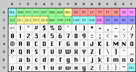
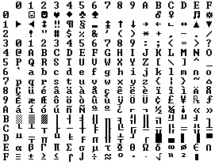

曾经对神秘的 Content-Type 标签感到迷惑过嘛？假定你唯一明白的就是把它放在HTML中,
而且从未完全理解它应该是什么？  

你曾经收到过一封来自保加利亚的朋友带有标题行"???? ?????? ??? ????"的邮件吗？   

我失望的发现很多软件开发者不是完全真正的了解字符集(character sets)，编码(encodings, Unicode)，所有这些神秘世界的最新情况。几年前，针对于[FogBUGZ](http://www.fog
creek.com/FogBUGZ)的测试人员想知道是否它有能力处理接收到的日语邮件。日语？有日语
邮件？我全然不知。当我仔细地检查我们用来处理MIME电子邮件的商用的ActiveX控件时，发
现它恰恰用字符集做了错误的事情，因此我们实际上不得不写大量的代码来撤销这些错误的
转换，并且正确地恢复它。那时，我研究了另一个商业类库，它也有完全被破坏的字符编码
存在。我和它的开发者进行了沟通，他几乎认为 “对于这种情况他们无能为力”。像多数程
序员一样，他只是希望这种情况将来被某种方式莫名的解决掉。  

然而那没用。曾几何时我发现流行的web开发工具PHP几乎[完全无视字符编码问题](http://
ca3.php.net/manual/en/language.types.string.php)，对于字符轻率的采用8位(或1个字
节)来表示，我认为， *再也无法忍受了* ，这使得开发良好的国际化web应用几乎不可能。  

所以我宣布:如果在2003年你仍然在从事编程工作，并且还不了解字符(characters)，字符集
(character sets)，编码(encoding, Unicode)的基础知识，那么我 *抓住* 你，将惩罚你让你
在潜艇中剥6个月的洋葱。我发誓我会那样做。  

还有一件事：  

<h5 align="center"> 其实这并没有那么难。 </h5>

这篇文章中，我将告诉你究竟 *每个杰出的程序员* 应该掌握什么。所有关于“纯文本 = ascii = 8位字符”的想法不仅是错误的，而且是彻底错误的，并且如果你仍旧那样编写程序，
你比一个不相信细菌存在的医师好不到哪里去。在阅读完这边文章之前，请不要再写一行代
码。  

开始之前，我应该提醒你，如果你是极少数掌握国际化的人中的一个，将感觉我的整个讨论
有点过分简单。我实际上试图以一个最低标准，以便于所有的人可以明白了发生了什么事，
并且编写 *有希望* 与除去不包含重音的英语语系以外的任何语言文字都能工作的代码。同时
可能提醒你字符处理仅是开始开发国际化运作的软件中微小的部分，但是一次仅能一件事，
那么今天这件事是字符集。  

##### 历史展望 #####

了解这些东西最简单的方式是按照时间顺序。  

这里你可能认为我将要讨论非常古老的字符集，像EBCDIC。嗯，我不会。EBCDIC与你的生活
不相关。我们不必那么久远。  

早在非常古老的岁月里，当Unix被创造以及K&R编写了[C编程语言](http://cm.bell-labs.com/cm/cs/cbook/)时，一切都是非常的简单。
EBCDIC有它自己的解决之道。重要的是字符仅仅是古老的无重音的英文字母，对于它们我们
有一个编码叫[ASCII编码](http://www.robelle.com/library/smugbook/ascii.html)，能够
使用32到127中的每一个数字表示每一个字符。32表示空格，65表示字母“A”等等。这样可
以很方便的按照7位去存储。当时多数的计算机是采用8位(8-bit)字节数，因此你不仅可以
存储每一个可能的ASCII字符，而且整整剩余一个位(bit)，如果你是邪恶的，可以用作你自
己的不光明正大的目的：在WordStar(文字之星，早期的文字处理软件)旁边的黯淡的灯泡实
际上是打开了单词中标识最后一个字母的最高位，强烈指责WordStar仅支持英文文本。低于
32的符号代码被成为*不可打印的*，而是用来骂人的。只是开个玩笑。它们被用作控制字符，
像7，使你的机器发出蜂鸣声；12促使文件的当前页飞出打印机，然后新的一页被输入。  

假设你是一个以英语为母语的人，那么一切都没有问题。

因为字节数有长达8位(bits)的空间，许多人开始认为，“天哪，对于我们自己的用途，我
们可以使用128-255间的符号代码”。问题是，许多人同时都有这个想法，并且在从128到255
的间隔中什么应该指代什么，他们都有自己的观点。IBM-PC有一些后来被称作OEM字符集的
东西，针对欧洲语言提供一些重音字符，以及[一串素描字符](http://www.jimprice.com/ascii-dos.gif)...横线，竖线，横线加一个
小的右边悬空的耳坠，等等字符，那么你可以使用这些素描字符在屏幕上构建出色的框线，
运行在你干洗店中的8088计算机上时，这些仍然是可见的。事实上当人们开始在美国以外购
买PCs时，各种不同的OEM字符集已经被设计，针对各自的目的，都采用最高的128个字符。
例如，在某些PCs上字符代码130显示为é，但在以色列销售的计算机上它表示希伯来文的第
三个字母()，因此当美国人将要发送他们résumés给以色列人时，它们将作为rsums被送达。
在很多时候，比如俄国人，用高于128的字符做什么，那里也有许多不同的观点，因此你甚至都无法可靠地交换俄语文档。  

